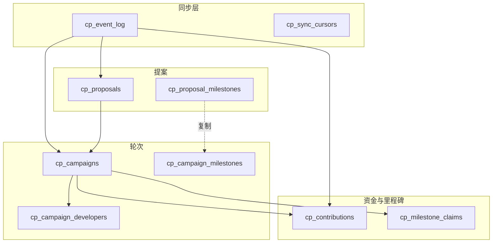

# Code Pulse 众筹：数据库表与流程

本文按业务时间线梳理众筹（Code Pulse）在 PostgreSQL 中涉及的表。表结构以 `backend/migrations/002_code_pulse.sql` 为主，`003_code_pulse_runtime_cache.sql`、`004_cp_sync_cursor_subgraph_health.sql` 为增补。

---

## 1. 链上数据进库（所有读模型的上游）

| 表 | 作用 |
|----|------|
| **`cp_event_log`** | 统一事件流水：每笔链上日志一行（提案/轮次/捐款/里程碑等），RPC 索引器或子图同步写入；聚合表多由此重算或增量更新。 |
| **`cp_sync_cursors`** | Code Pulse 同步进度（如最后块号等）。`004` 为其增加子图健康字段：最近成功查询时间、错误信息、连续失败次数等。 |

没有可靠的事件入库，后续提案/轮次/捐款等读模型不会更新。

---

## 2. 提案阶段（发起人 → 审核）

| 表 | 作用 |
|----|------|
| **`cp_proposals`** | 提案主数据：发起人、GitHub、目标金额/时长、状态（提交/通过/拒绝）、待审核轮次参数、`last_campaign_id` 等。列表/详情页的核心。 |
| **`cp_proposal_milestones`** | 提案侧里程碑定义：`submitProposal` 的初始里程碑 + 待审核新轮的里程碑（`source_type` 区分 `proposal_initial` / `pending_round`）。 |

**流程对应**：提交提案 → 写入/更新 `cp_proposals` 与 `cp_proposal_milestones`；管理员审核 → 更新 `cp_proposals` 状态与时间戳等。

---

## 3. 开启一轮众筹（审核通过后 launch）

| 表 | 作用 |
|----|------|
| **`cp_campaigns`** | 单轮众筹：关联 `proposal_id`、`round_index`、目标/截止/已筹/状态、成功/失败时间等。 |
| **`cp_campaign_milestones`** | 本轮里程碑快照（从提案里程碑复制）：是否已审批、是否已 claim、`unlock_at` 等。 |
| **`cp_campaign_developers`** | 本轮开发者名单（可多次 add/remove，用 `is_active` 表示当前是否在组）。 |

**流程对应**：`launchApprovedRound` → 新 `cp_campaigns` + 复制出 `cp_campaign_milestones`；增删开发者 → `cp_campaign_developers`。

---

## 4. 捐款与退款

| 表 | 作用 |
|----|------|
| **`cp_contributions`** | 按 `(campaign_id, contributor_address)` 聚合：累计捐款、已领退款、最后捐款/退款时间。 |

**流程对应**：`Donated` / `RefundClaimed` 等事件 → 更新 `cp_contributions`（通常与 `cp_event_log` 一并维护）。

---

## 5. 里程碑放款（众筹成功后）

| 表 | 作用 |
|----|------|
| **`cp_milestone_claims`** | 某轮某里程碑下，某开发者领取金额 + 交易哈希（主键含 campaign、milestone、developer）。 |

**流程对应**：里程碑审批通过 → `cp_campaign_milestones`；开发者 claim → `cp_milestone_claims` 并更新里程碑 `claimed` 等。

---

## 6. 平台资金（与单轮众筹并列）

| 表 | 作用 |
|----|------|
| **`cp_platform_fund_movements`** | 平台捐赠/提现流水（`donateToPlatform` / `withdrawPlatformFunds`），供管理台余额与流水。 |

---

## 7. 用户展示与入口

| 表 | 作用 |
|----|------|
| **`cp_wallet_profiles`** | 钱包展示名、GitHub、头像等扩展信息。 |
| **`cp_wallet_roles`** | 角色与作用域（全局/提案/campaign），支撑「我的工作台」等入口。`003` 增加 `source`、`source_block_number`、`synced_at` 等与链上派生同步相关字段。 |

---

## 8. 发交易与排错

| 表 | 作用 |
|----|------|
| **`cp_tx_attempts`** | 每次链上动作全生命周期：模拟/签名/广播/回执、revert 解码、`tx_status` 等。 |

---

## 9. 运维与统计

| 表 | 作用 |
|----|------|
| **`cp_system_states`**（`003`） | 合约级缓存：如 owner、`paused`、同步块号等。 |
| **`cp_snapshots_daily`** | 可选每日统计快照（首页趋势类 dashboard）。 |

---

## 10. Bank 充值/提现（与 `cp_*` 并列）

若产品路径包含「链上 MultiAssetBank 充值后再参与链上操作」，会用到 `backend/migrations/001_bank_ledger.sql`：

| 表 | 作用 |
|----|------|
| **`bank_deposits`** / **`bank_withdrawals`** | Bank 合约充值/提现索引。 |
| **`chain_indexer_cursors`** | Bank（或其它链上索引）扫块进度。 |

捐款若仅走 Code Pulse 合约，核心业务仍以 **`cp_*`** 为主；Bank 表属于并列子系统。

---

## 实体关系简图

---

## 迁移文件索引

| 文件 | 内容概要 |
|------|----------|
| `002_code_pulse.sql` | 上述大部分 `cp_*` 表。 |
| `003_code_pulse_runtime_cache.sql` | `cp_system_states`；`cp_wallet_roles` 扩展列。 |
| `004_cp_sync_cursor_subgraph_health.sql` | `cp_sync_cursors` 子图健康列。 |
| `001_bank_ledger.sql` | `bank_*`、`chain_indexer_cursors`。 |
